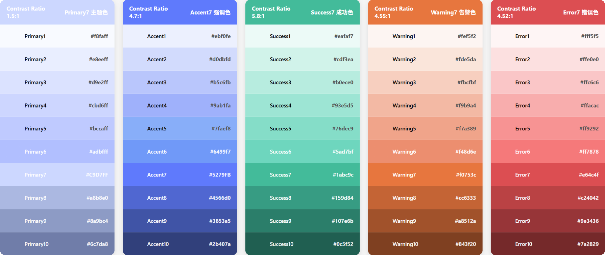
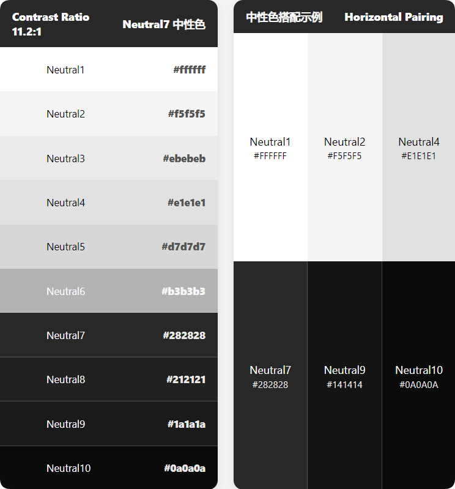

# Color 色彩
> 色彩是设计中重要的元素，它可以传达情感、信息和功能。

## 概述
Vina Design 的配色方案遵循了 Vina Design 轻量、多元、开放、感知的价值观，充分考虑各种色彩要求，遵循无障碍规范，提供了一套完整的色板。

## Vina Design 色板
Vina Design 色板包含功能色和中性色两个部分。

### 功能色
功能色是指在特定场景出现，可以表达特殊内容的颜色，我们定义了五种颜色。在遵循色彩通用含义选取色相的基础上，结合 WCAG2.1 规范，使其达到可用标准。

### 中性色
中性色包含一些灰黑色，用于指示文本和布局的层级关系，常用文字与其色彩对比度均大于 4.5 ，满足 WCAG2.1 标准。

